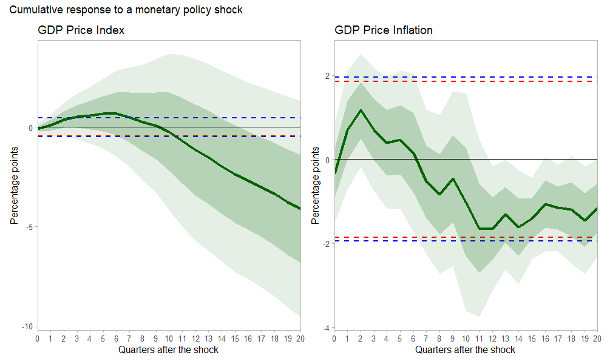

## Significance Bands for Local Projections Using R

This note aims to replicate the main finding presented in the paper "Significance Bands for Local Projections" by [Inoue, Jordà, and Kuersteiner (2023)](https://arxiv.org/abs/2306.03073). The original paper outlines the importance of using significance bands instead of traditional confidence bands for evaluating the dynamic impact of a treatment on an outcome variable via local projections. In particular, the note employs the R programming language to implement these methods, providing a detailed, step-by-step guide for researchers interested in applying them in their own analyses.

See [RMarkdown notebook](https://raw.githack.com/itamarcaspi/romers_sig_bands/master/main_rr_2023.html)

